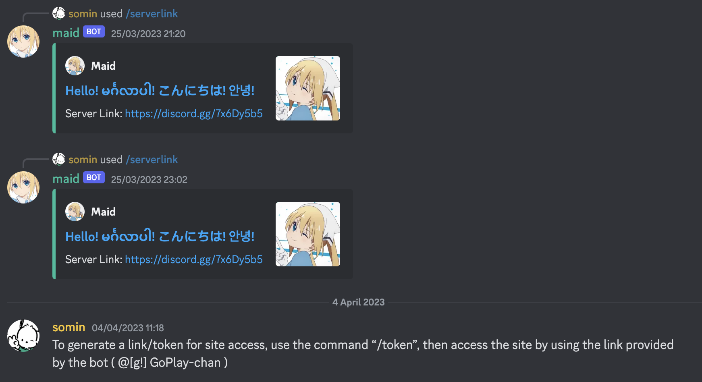

## Description

Discord JS bot I developed to use in my friends' servers.
Self taught JS in my first year of computer science journey to develop.
It performs: mentions, replies, alerts, block words.
Updated in 2022 to support commands for image pulling from subreddit sources.

---

## Development Log
### Year
- 2022 (version 03 - added slash commands)
- 2019 (version 02 - dependencies update)
- 2017

